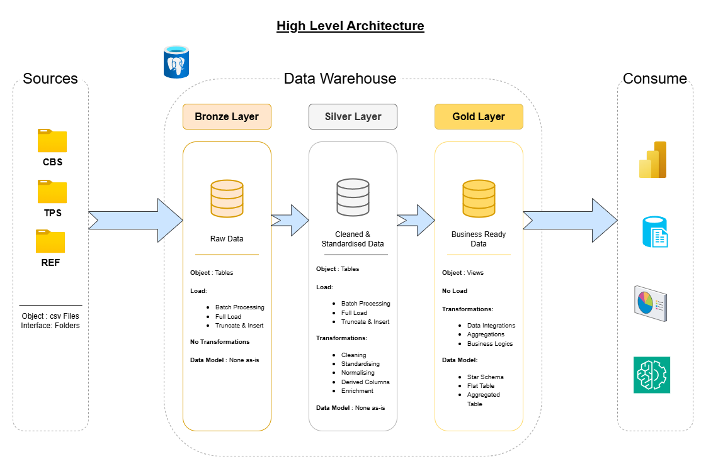

# :bank: Retail Banking Data Warehouse

---

## :bulb: Project Overview
This project details the end-to-end development of a modern data warehouse for a simulated UK retail bank, utilizing **PostgreSQL**. It focuses on consolidating customer, account, and transaction data from 6 London branches for **Q1 2024**. The core aim is to create a robust data foundation for Business Intelligence (BI) reporting, KPI dashboards, and to showcase a comprehensive ETL pipeline that mirrors real-world data patterns and challenges. Data is synthetically generated using Python (Faker).

---

## :rocket: Project Requirements
- **Architecture**: Medallion Data Architecture
  - **Bronze**: Raw data tables loaded directly from CSV files (e.g., from simulated source systems).
  - **Silver**: Cleansed and conformed tables, where data is deduplicated, correctly typed, trimmed, and quality checks are applied.
  - **Gold**: Analytics-ready materialized views structured in a **star schema** (fact and dimension tables) for optimal querying.

- **Data Scope**:
  - Customers: ~2,000 unique customer records.
  - Accounts: ~2,450 active bank accounts.
  - Transactions: ~65,000 individual financial transactions for Q1 2024.
  - Initial balances: Account balances as of 2024-01-01.
 
- **Business Goals**:
  - Provide deep visibility into customer activity, channel performance, transaction volumes, and account behavior.
  - Support informed decision-making across various business functions including operations, marketing, business development, and risk management.
    
- **Documentation**:
  - Clear data model diagrams and a comprehensive data dictionary for both business stakeholders and analytics teams.
  - Full tracking of business requirements, detailed ETL logic, and robust data-quality checks.


---

## :building_construction: High-Level Architecture



---

## :card_index_dividers: Repository Structure

```
data-warehouse-project/
│
├── datasets/                           # Raw CSVs for customers, branches, accounts, transactions (simulated source data)
│
├── docs/                               # Project documentation and architecture details
│   ├── high_level_architecture.drawio  # Draw.io file showing overall medallion architecture
│   ├── data_catalog.md                 # Catalog of datasets with field descriptions & metadata
│   ├── data_flow.drawio                # Draw.io file for the data flow diagram
│   ├── data_model.drawio               # Draw.io file for data models (star schema)
│   ├── naming-conventions.md           # Consistent naming guidelines for tables, columns, and files
│   ├── synthetic_data_generation.md    # Business logic and python code for generating data    
│
├── scripts/                            # SQL scripts for ETL and transformations
│   ├── bronze/                         # Scripts for extracting and loading raw data
│   ├── silver/                         # Scripts for cleaning and transforming data
│   ├── gold/                           # SQL scripts for building the star schema (fact and dimension tables/materialized views)
│
├── tests/                              # Test scripts and data quality checks 
│
├── README.md                           # Project overview and requirements
├── LICENSE                             # License information for the repository
├── .gitignore                          # Files and directories to be ignored by Git

```

---

## :man_technologist: Technology Stack
- **Database**: PostgreSQL  
- **Scripting**: PLgSQL, Python (Faker, pandas, numpy)
- **Version Control**: Git / GitHub  

---

## ✨ Key Skills Demonstrated:
-   **Business Acumen:** Capturing business requirements and translating them into data solutions.
-   **Data Architecture:** Designing and implementing a Medallion architecture.
-   **Data Modeling:** Developing a star schema for analytical reporting.
-   **ETL Pipeline Development:** Building robust Extract, Transform, Load processes.
-   **SQL Development:** Advanced SQL for data manipulation, transformation, and querying.
-   **Data Quality & Governance:** Implementing checks and ensuring data integrity across layers.
-   **Performance Tuning:** Optimizing database queries and structures for efficient data retrieval.
-   **Automation & Logging:** Automating data processes and implementing logging for monitoring.
-   **Documentation:** Creating clear and comprehensive project documentation.

---

## 🛡️ License

This project is licensed under the [MIT License](LICENSE). You are free to use, modify, and share this project with proper attribution.

---

